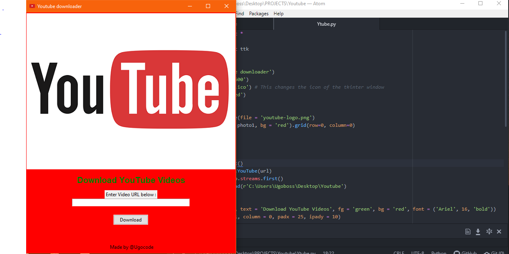

# Youtube-Downloder
A Python software for downloading videos from Youtube

# Software Image

# How it works
Just copy the URL of the video you want to download to your computer and paste in the box provided 
then click download and boom you are done! 

# File Guide
Ytube.py : python script for this project
YoutubeImage.png : Picture of this project 
